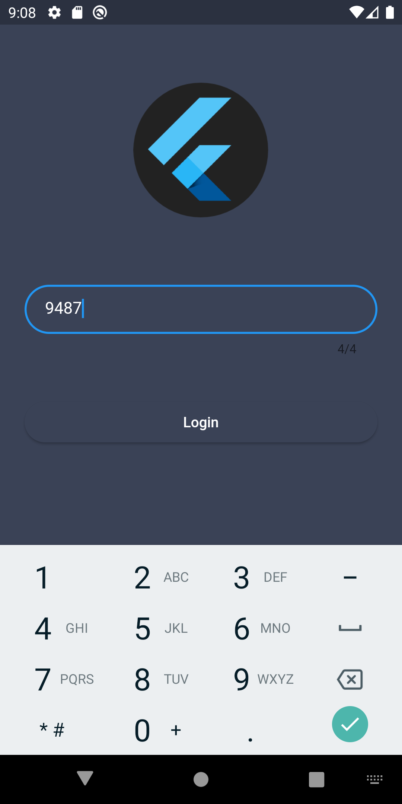
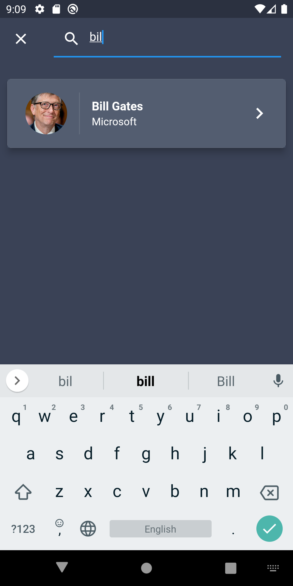

# what_the_call

This is a flutter app which available on Android and iOS.

## Screenshots

<h2>Login page</h2>
 
 

<h2>List page</h2>
 
 

<h2>Search function</h2>
 
 

<h2>Contact detail</h2>
 
 

## Widget Usage (Emphasis)
- CircleAvatar
- ListView
- AppBar
- Card
- Hero
- GestureDetector

## Flutter Info
- Flutter 2.5.3 • channel stable • https://github.com/flutter/flutter.git
- Framework • revision 18116933e7 (8 weeks ago) • 2021-10-15 10:46:35 -0700
- Engine • revision d3ea636dc5
- Tools • Dart 2.14.4