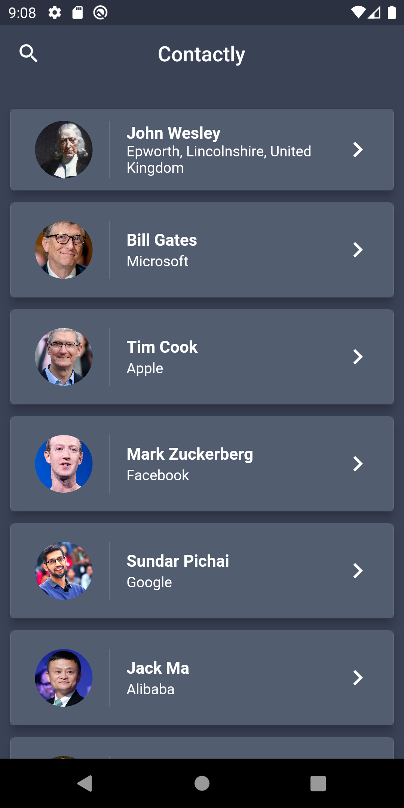

# what_the_call

This is a flutter app which available on Android and iOS.

## Screenshots

<h2>Login page</h2>
 
 

<h2>List page</h2>
 
 

<h2>Search function</h2>
 
 

<h2>Contact detail</h2>
 
 

## Widget Usage (Emphasis)
- CircleAvatar
- ListView
- AppBar
- Card
- Hero
- GestureDetector

## Flutter Info
- Flutter 2.9.0-1.0.pre.144 • channel master • https://github.com/flutter/flutter.git
- Framework • revision 07a36f07e3 (9 weeks ago) • 2021-12-21 01:09:07 -0500
- Engine • revision d3075cd085
- Tools • Dart 2.16.0 (build 2.16.0-123.0.dev) • DevTools 2.9.1